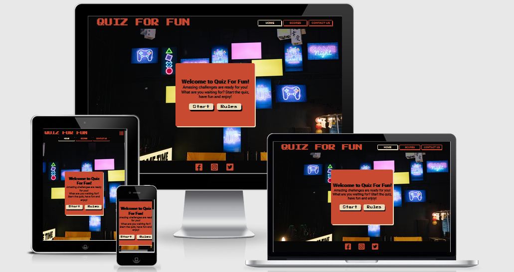

# **Quiz For Fun** Website

### **Developer: Claudio Crocilla**

## **Overview**

#### The website offer the possibility to play amazin quizzes! 
#### Internet users all around the world love playing quiz testing theiw own knowledge and challenge themselves against others. The idea of this website is to provide a means to partecipate to a frinendly competitition, answering questions about movies or videogames, granting a few relaxing minutes to yourself or just letting your competitive side go wild.
#### The website is intuitive and user-friendly! The users can insert their Username, select the grade of difficulty (this will affect the time available to answer the questions), the category (movies or videogames) and start playing! The users can also subscribe to a newsletter to receive regular updates on new quizzes as well as provide a feedback or report issues. 
#### A Leaderboard will show the top 10 users and their scores.
#### Good luck, enjoy the questions and might the force be with you! 

#### Click in the image above to access the Live Website or [click here!](https://ccrocilla.github.io/quiz-for-fun/ "Quiz For Fun")

## **Project** 

### **User Goal**
- Easy, Intuitive and User-Friendly Website!
- Wide compatibility with every Browsers and Devices.
- 10 questions available for two different categories (Movies and Videogames), selected from a randomized larger pool of questions, to provide the user with a unique experience and to incentives for more playing.
- Different categories and level of difficulties to increase challenges for the most competitive users.
- Best players will make the leaderboard showing the Top 10 user's scores
- Newsletter available to receive weekly updates on new quizzes via the Contact Us Page.
- Possibility for the user to send a feedback and/or report an issue in the quiz.
- Possibility for the user to send a feedback and /or report issues/bugs in the quiz.

---

## **User Experience (UX)**

### **User Stories**
- #### First Time Visitor Goals
	1. As a First Time visitor of a website dedicated to quiz, I want to have a visual impact on the Landing Page that will attract my attention.  
	2. As a First Time Visitor, I want to be able to navigate easily through the website.
	3. As a First Time Visitor, I want to be able to see the available quiz categories.
	4. As a First Time Visitor, I want to be able to be able to access and play quiz games. 
	5. As a First Time Visitor, I want to be able to have clear Instructions on how the game works.
	6. As a First Time Visitor, I want to be able to check my final score.
	7. As a First Time Visitor, I want to find the website pleasant to the eye, visually intuitive, with catchy colours and images.
   
- #### Returning Visitor Goals
	1. As a Returning Visitor, I want to be frequently able to find new quiz questions.
	2. As a Returning Visitor, I want to be able to check my score against others in a leaderboard.
	3. As a Returning Visitor, I want to be able to report issues.
	4. As a Returning Visitor, I want to be able to provide feedback.
	5. As a Returning Visitor, I want to access the website through my social media accounts.

- #### Frequent User Goals
	1. As a Frequent User, I want to see new quizzes.
	2. As a Frequent User, I want to play with higher level of difficulties.
	3. As a Frequent User, I want to get a better personal score.
	4. As a Frequent User, I want to sign up to the Newsletter in order to weekly updates on the new quiz.
	5. As a Frequent User, I want to be able to check my score against others in a leader board.
	6. As a Frequent User, I want to sign up to the Newsletter in order to get weekly updates on new quizzes.
	7. As a Frequent User, I want to check if the reported issues are being resolved.
	8. As a Frequent User, I want to share feedback on the website.
	

<!-- Use Cases Area -->
### **Use Cases**

### *_Home Page_*

    
Description

    
- Users can use open this website to play trivia quizzes.
- Users should be able to read Instructions/Rules.
- Users should be able to start a new game.
- Users should be able to enter their usernames.
- Users should be able to select different type of difficulties.
- Users should be able to select different type of categories.
- Users should be able to navigate to the Scores and Contact Us pages. 

    
System & Actors

**System:** Website with Quiz.

**Actors:** User looking for playing some amazing trivia quizzes.

    
Pre-Conditions

- Users should enter Username in order to play.
- Users should selected the difficulty level and the questions categories (video games or movies).

    
Basic Flow

- The user browses for quiz and discover the website. The user navigates to the Home Page of the website, and is attracted by the visual impact of the website. 
- The user read the instructions/rules. 
- The user start a new game. 

    
Alternative/Exception Flow

- When the user selects a non-existent page, a 404 Error Page will be prompted guiding the user back to the Home Page.

### *_Scores Page_*

    
Description

    
- Users, can decide if they want to save their score after each played game.   
- Users can open this page to check their saved score against other players.
- Users should be able to check the saved scores vs the difficulty level.
- Users should be able to go back to the Home Page. 
 

 

    
System & Actors

 
**System:** Website with Quiz.
 
**Actors:** User looking for saved scores vs other players or level of difficulties.

 

    
Pre-Conditions

 
Users should enter Username in order to save the score after the game.
Userd should selected the difficulty level and the questions categories (video games or movies).
User should play the game and answer all the available questions.
Users should save their score at the end of the game to be included into the leader board.

 

    
Basic Flow

 
- The user is playing the game answering all available questions. At the end of the game the user can visualise the obatained score along with a message from the system.
The user can decide if he/she wants to save the score into the leader board. The user can access the score page to check the score against other player of per difficulty level.  The user can navigate back to the Home Page of the website. 

 

    
Alternative/Exception Flow

 
- When the user selects a non-existent page, a 404 Error Page will be prompted guiding the user back to the Home Page.

### *_Contact Us_*

    
Description

- Users can use this page of the website to subscribe for the newsletter, provide a general feedback or report issues. 

    
System & Actors

**System:** Website with Quiz.

**Actors:** Users that want to subscribe to a newsletter, provide feedback or report issue.

    
Pre-Conditions

- The user should provide a Username.
- The user should provide an Email Address.

    
Basic Flow

- The user browses for quiz and discover the website. The user navigate to the Home Page and then go into the "Contact Us" Page. 
- The user fill in the mandatory fields (Username, Email Address).
- The user can select using the checkboxes provided if he/she wants to provide a general feedback, subscribe for the newsletter or report issues/bugs.
- The user will be prompted to a dummy "Thank you" Page which provides a clear feedback that the form has been successfully submitted. 

    
Alternative/Exception Flow

- The user can reset the filled form.
- When the user selects a non-existent page, a 404 Error Page will be prompted guiding the user back to the Home Page.

---

## **Design**

#### The webpage has been designed to provide a simple, interactive and intuitive view which is able to offer a pleasant experience to users that want to relax or unlash their competitive side playing trivia quizzes. The website allows the user to select different categories of trivia questions (video games or movies). A modal window can be opened to access the instruction to play the game. 
#### Every page has a minimalistic structure which however contains all the relevant features in order to provide the user with an interactive, clear and effective experience.  

- ### **Colour Scheme**
#### The goal is to use a colour palette that will provide the user with a good and positive impact at a first glance, when opening the website and through the entire navigation experience. 
#### The list of colors is chosen to be pleasing to the eyes providing an excellent contrast that will allow the user to have prolonged navigation hours without tiring the eyes. 
Colour Source: 
  - #### [Adobe Color](https://color.adobe.com/create/color-wheel)
  - #### [Color Hunt](https://colorhunt.co/) 
#### The main colors are variant of the Black (#070707) and Beige (#ECDBBA) and Orange (#C84B31) characterizing the full website while a variant of the Red (#E40017) and Green (#357C3C) are used to mark incorrect vs correct answers providing an immediate and visual impact to the users.

 

- ### **Typography**
#### Google Fonts has been used to select the fonts for the Website. 
#### The Main fonts used are: 'Press Start 2P' and 'Roboto' while Consive and Sans-serif has been set up as fall-back in case the main font is not loaded. 
Source:
  - [Google Fonts](https://fonts.google.com/)

- ### **Images**
#### Real and effective images have been used as background to provide a pleasant visual experience to the user.
Sources:  
  - [Pexels](https://www.pexels.com/)

--- 

## **Features**
- ### *__Structure__*:
The Website is composed of 5 different pages. Each of these page has been structured in a simple, easy and user-friendly way. 
The Structure of the website and the components used are listed below:

- ### *__Home Page__*:
#### The Home Page shows the logo of the website on the top left of the page and a navigation bar menu on the top right.
#### A border and text color change animation activates when the user hover the mouse over the elements in the nav bar, highlighting the content. 
#### The active page change the default color of the text and the color of the border in the navigation bar menu when selected. 
#### Depending on the device used (if laptop, desktop, tablet or smartphone) the positions of the nav bar change, creating an hamburger menu that will be displayed on the top right part of the page to adapt the view for a highly responsive rendering. 
#### Those behaviours are consistent in all pages. 
#### Following from Logo and the nav bar, the user will see a Background Image inside of which there is a section dedicated to the game in the center of the page.
#### The Game Area shows a brief welcome message and the Start and Rules Buttons.
#### By clicking on the latter the instructions/rules of the game can be accessed opening a modal pop-up window. While, clicking on the Start button, the user is able to access a pre-quiz form area, where username (with a max of 8 characters), level of difficulty (Easy, Medium, Hard) and categories (movie or videogames) can be selected. The level of difficulty will dictate the available time to answer each question going from 60 to 30 to 15 s depending on the Easy, Medium and Hard levels, respectively. These fields are mandatory, if not selected a warning message will appear to the user. Once this information is indicated, the game will start. 
#### All the information (Username and Difficulty) filled by the user is saved in the Local Storage of the browser and if the user access again the Pre-Quiz Game Area, the username will be automatically filled in. 

- ### *__Quiz Area__*:
 
#### The quiz questions are divided into two main categories, movies or video games. To win the game, the user needs to correctly answer 10 questions in the assigned time. For each question, the question number, the score and the available time are displayed on the top. 
#### The question with 4 possible answers are presented to the user, each button (with an answer) changes colour when the users hover the mouse over it. Once the answer is selected, a function in the JavaScript code section, will check and will assign a green or red colur if the answer is correct/incorrect, respectively. 
#### In the JavaScript code a function is used to randomly select over a larger available pool, the 10 questions shown in the game area. The random nature of this selection allows the user to be presented with different combination every time the game is played. Every timeWhenever  the users answer a question, the time counter is resented to the original level (depending on the level of difficulty), the score increases (if the correct answer is selected) and the question counter (question number) increases. 
#### When the user completes the game or if the available time runs out, he/she is redirected to the Scores Page, where a message provides feedback on the quality of the played game and where the user can select if he/she wants to save the final score into the leader board.   
 
- ### *__Scores Page__*:
#### This page has Header and Footer consistent with the Home Page.
#### The page is characterized by an image extended as background on top of which there is the Score Area. 
#### As mentioned in the Section above, when the user(s) completes the game, he/she is redirected to the Scores page. 
#### At this stage a message is displayed showing the Username, the Score and some witty feedback to the users, giving them the possibility to Save (or Not) the Score in an external Database (RestDB.io). 
#### If the user clicks on the Yes Button to Save the Score, a Fetch Function with a POST method is triggered in order to save the information into the database. 
#### If the user clicks on the No button the Leader board will be retrieved displaying the Scores of other users using a fetch function with the GET method. In addition, the user can access the leader board by clicking directly on the Score anchor element in the NavBar. The redirection after the game or directly by clicking the Score button was implemented by using Query Parameters. 
 
- ### *__Contact Us Page__*:
#### This page has Header and Footer consistent with the Home Page.
#### The page is characterized by an image extended as background on top of which there is a form that the user can fill with the following information: Username, Email Address and a Radio Buttons that will allow the user to select:
- Newsletter (the users can receive the newsletter weekly).
- Feedback (The user can provide a general feedback on the website).
- Report Issue (The user can report an issue).
#### A Reset and a Submit Buttons are included.
#### The Reset Button resets the form. 
#### The Submit Button opens a dummy thank you page to provide a clear feedback to the user stating that the form has been sent correctly.  
#### If the Radio button selected is “Report Issue” or “Feedback” a Text area will be displayed allowing the user to insert text, while if the “Newsletter” radio button is selected the Text area field is hidden.

- ### *__Thank you page__*:
This page will be triggered when the user clicks on the Submit Button in Contact Us Page. 
The page is characterized by an image extended as background overlaid by a clear message for the user.
This page is used to let the user know that the feedback or the bug has been reported correctly.
The users also have the possibility to click on the Home button to navigate back to the Home Page. 

- ### *__404 Error Page__*:
For any broken or incorrect links, the 404 Error page will be triggered. Here the user will have an image displayed in the background and above a text box that will inform the users that the page is not correct. 
The users also have the possibility to click on the Home button to navigate back to the Home Page. 
 
---

## **Wireframe**
#### Balsamiq has been used in order to create the wireframe.
#### Below you can open the accordions divided by page and by device used (desktop, tablet and smartphone).

- ## Home Page 

    
Click here for Desktop View
  

    
Click here for Tablet View

    
Click here for Smartphone View

- ## Select Game Area

    
Click here for Desktop View

    
Click here for Tablet View

    
Click here for Smartphone View

- ## Quiz Area

    
Click here for Desktop View

    
Click here for Tablet View

    
Click here for Smartphone View

- ## Contact Us Page

    
Click here for Desktop View

    
Click here for Tablet View

    
Click here for Smartphone View

- ## Thanks You Page

    
Click here for Desktop View

    
Click here for Tablet View

    
Click here for Smartphone View

- ## 404 Error Page

    
Click here for Desktop View

    
Click here for Tablet View

    
Click here for Smartphone View

---

## **Technologies Used**

- ### **Languages**

#### The Languages used are:
 - HTML5
 - CSS3
 - JAVASCRIPT

#### Only custom HTML, CSS and JavaScript Code has been used.

- ### **Frameworks, Libraries & Programs Used** 

#### No Design Framework has been used.

- #### Google Fonts: 
    - #### Google fonts were used to import the font into the style.css file which is used on all pages throughout the project.

- #### Font Awesome:
    - #### Font Awesome was used on all pages throughout the website to add icons for aesthetic and UX purposes.

- #### Git: 
    - #### Git was used for version control by utilizing the Gitpod terminal to commit to Git and Push to GitHub.

- #### GitHub: 
    - #### GitHub is used to store the projects code after being pushed from Git.

- #### Balsamiq: 
    - #### Balsamiq was used to create the wireframes during the design process.

- #### TinyPNG
    - #### TinyPNG has been used to compress images.

- #### Convert.io
    - #### Convertio has been used to convert the images in webp extension.

- #### RestDB.io
    - #### Restdb.io is an online NoSQL database backend for web and serverless "low code" applications. it has been used to model information quickly amd for the data management. 

---
## **Testing**
The testing phases have been carried out using the **W3C Javascript Validator**, **W3C CSS Validator** and **W3C Markup Validator** (for all pages). No errors have been identified from the Validators as can be seen in the screenshot below: 

- **JavaScript**

    
Click here for W3C Javascript Validator

- **CSS**

    
Click here for W3C CSS Validator

    
Click here for W3C CSS Validator - Warning

- **HTML**

    
Click here for W3C Markup Validator - Home Page

    
Click here for W3C Markup Validator - Contact Us

    
Click here for W3C Markup Validator - Thank You

    
Click here for W3C Markup Validator - Error 404

- ### **Lighthouse Validator**
Below it is possible to take a look at the result obtained in Lighthouse:

    
Click here for Lighthouse Desktop - Homepage

    
Click here for Lighthouse Mobile - Homepage

    
Click here for Lighthouse Desktop - Contact Us

    
Click here for Lighthouse Mobile - Contact Us

    
Click here for Lighthouse Desktop - Thanks you

    
Click here for Lighthouse Mobile - Thanks you

    
Click here for Lighthouse Desktop - Error 404

    
Click here for Lighthouse Mobile - Error 404

- ### **Test Cases**

List of Test Cases performed. These Tests were executed for all available Devices listed in the section below including also Layout testing. 

| Page | Feature | Expected Result | Status | 
| --- | --- | --- | --- |
| Home | Header | Make sure that the Logo and the Navigation Bar are displayed on the top part of the Home Page. | Pass |
| Home | Header | Make sure that by clicking on the Logo the user is redirected to the Home Page. | Pass |
| Home | Header | Make sure that the Background Image does no overlap with the Logo and Nav Bar. | Pass |
| Home | Header | Make sure that the Hamburger Menu is displayed in mobile. | Pass |
| Home | Header | Make sure that the Navigation Bar Menu is displayed only after clicking on the Hamburger icon in mobile | Pass |
| Home | Application | Make sure that the Welcome Text is displayed and does not overlap nor it is cut-off. |  |
| Home | Application | Make sure that the Start and Rules Buttons are displayed. | Pass |
| Home | Application | Make sure that the Rules Button can be clicked and that open the Modal with the rules/instructions for the user. | Pass |
| Home | Application | Make sure that the Start Button open the Pre-Quiz Area. | Pass |
| Pre-Quiz | Images | Make sure that the background image is displayed correcly. | Pass |
| Pre-Quiz | Form | Make sure that the field Username is editable and that the max character available is 8. | Pass |
| Pre-Quiz | Form | Make sure that the field Username is mandatory. | Pass |
| Pre-Quiz | Form | Make sure that all the radio buttons are selectable and mandatory. | Pass |
| Pre-Quiz | Form | Make sure that when the Movies and Videogames buttons are clicked, if the Username or the Checkbox are not filled it is not possible to start the quiz. | Pass |
| Pre-Quiz | Form | Make sure that when the Movies and Videogames buttons are clicked, if the Username or the Checkbox are filled the game starts. | Pass |
| Pre-Quiz | Form | Make sure that when the Movies and Videogames button the Username and Difficulty are saved in the Local Storage. | Pass |
| Quiz | Application | Make sure that the Question counter is displayed on top left of the game area and that starts from the first question. | Pass |
| Quiz | Application | Make sure that the Score counter is displayed on top center of the game area and that starts from 0. | Pass |
| Quiz | Application | Make sure that the Countdown Timer is displayed on top right of the game area and that display the time based on the difficulty selected. | Pass |
| Quiz | Application | Make sure that the correct category questions are displayed (Movies or Videogames) upon the selection made. | Pass |
| Quiz | Application | Make sure that each button is clickable once. | Pass |
| Quiz | Application | Make sure that once one of the buttons is clicked the color of the Answer changes color. | Pass |
| Quiz | Application | Make sure that once one of the buttons is clicked the next question is automatically displayed and the color is reset to the original ones. | Pass |
| Quiz | Application | Make sure that if the Timer runs out the next question is automatically displayed. | Pass |
| Quiz | Application | Make sure that the user select the correct answer the score increase by 100 Points. | Pass |
| Quiz | Application | Make sure that the user select the incorrect answer the score does not increase. | Pass |
| Quiz | Application | Make sure that for each new question displayed the timer is reset (based on the difficulty selected). | Pass |
| Quiz | Application | Make sure that when all the 10 questions have been answered (or Not) the user is redirected to the Scores Page. | Pass |
| Scores | Application | Make sure that when redirected from a game played the user see the the thanks for Playing message and the score made. | Pass |
| Scores | Application | Make sure that when redirected from a game played the user after seeing the score, can decide to save or not the Score. | Pass |
| Scores | Application | Make sure that by clicking on the No Button, the score is not saved in the Database and that the Leaderboard is displayed. | Pass |
| Scores | Application | Make sure that by clicking on the Yes Button, the score is saved in the Database and that the Leaderboard is displayed. | Pass |
| Scores | Application | Make sure that by clicking on Scores anchor element just the Leaderboard is displayed. | Pass |
| Contact Us | Form | Make sure that all the fields (Username and Email) are mandatory. | Pass |
| Contact Us | Form | Make sure that all the radio buttons are clickable. | Pass |
| Contact Us | Form | Make sure that all the Text Area field appear only if the user flags the checkboxes (Quiz, Feedback, Report Issues). | Pass |
| Contact Us | Form | Make sure that the Reset Form Button works and that deletes all the information entered in the form. | Pass |
| Contact Us | Form | Make sure that the Submit Button works and that opens the thank you page. | Pass |
| 404 Error Page | Image | Make sure that the background image is displayed correctly when the user is automatically redirected to the 404 Error Page if trying to displaying a page that does not exist in the website. | Pass |
| 404 Error Page | Text | Make sure that the text is displayed in the center of the page. | Pass |
| 404 Error Page | Text | Make sure that the user can be redirected back to the Home Page using the Home button. | Pass |
| Thank you Page | Image | Make sure that the page opens when the user clicks on the Submit Button in Contact Us Page | Pass |
| Thank you Page | Image | Make sure that the background image is displayed. | Pass |
| Thank you Page | Text | Make sure that the text is displayed in the center of the page. | Pass |
| Thank you Page | Text | Make sure that the user can be redirected back to the Home Page using the Home button present. | Pass |

### **Additional Tests**
Tests have been performed on Firefox, Microsoft Edge, Chrome and Safari and the result is consistent in all the browsers. 

Additional tests include checks on different devices using the Toggle Device Emulation in Firefox and Microsoft Edge. Below the list of devices used for the tests through the Responsive Design Mode in Firefox is shown:
* iPhone 12 Pro Max
* iPad Pro
* iPad 
* Moto 4G
* Samsung Galaxy S20 Ultra
* Surface Duo

### **Bugs**
- No bugs have been found in the website during the test phase.

### Future Implementation
- Difficulty Points: In future implementation different point scores will be assigned depending on the difficulty level selected by the user. 
This will also be reflected in the Leader board visualization with 3 different associated leader board. The user will have the possibility to switch using a Easy, Medium or Hard button located below the leaderboard title. 
 
- Login: a Login System and a Check Validation for the Username used in the Pre-Quiz Area. 
The user will have the possibility to access the website with a login and password, playing the games. Each score per user will be overwritten to maintain database dimension.
If the user is a guest, he/she will also be able to play the game by inserting only a username. If this exists an error message will be prompted to. 
 
- More Questions More Fun: Add More Categories and more Questions to give the user the possibility to visit the website more and more. 
 
- Newsletter, Report and feedback: future implementations will include the creation of a form. Once the user compile this, he/she will receive a weekly/monthly email with website news. Thanks to this form, it will be possible to send a real notification helping the developer implementing suggested features or fixing any issues reported by the users.
It would be also important to implement a captcha in the form before the submission to avoid spam. 

---

## **Development** 
### Deployment

- ### **Github**
The repository for the project Sweet & Sour has been created using Github using the following procedures:
1. Create a Github account [Github.com](https://github.com/)
2. In the top left Github Home Page click on the green New Button in order to create a new repository
3. Select the Template if available (Example: Code-Institute-Org/gitpod-full-template)
4. Choose the Repository name
5. Click on the Create Repository Button in order to create the repository
6. Install the Gitpod Extension in your browser
7. Once Gitpod Extension has been installed, accessing the repository previously created, click on the Gitpod Button
8. A new page will be opened and the Workspace will be created
   

- ### **GitHub Pages**
The project was deployed to GitHub Pages using the following steps:
1.	Log in to GitHub and locate the GitHub Repository created
2.	Click on the Setting Button
3.	On the left menu bar, click on the "Pages" Tab
4.	Under "Source", click the dropdown called "None" and select "Main"
5.	The page will automatically refresh
6.	When the website is disployed, on top of this page you can see the link of the live website 

<!-- Forking Content from Code Institute Readme File Sample -->
- ### **Forking the GitHub Repository**  
By forking the GitHub Repository we make a copy of the original repository on our GitHub account to view and/or make changes without affecting the original repository by using the following steps:
1.	Log in to GitHub and locate the GitHub Repository
2.	At the top of the Repository (not top of page) just above the "Settings" Button on the menu, locate the "Fork" Button
3.	You should now have a copy of the original repository in your GitHub account

- ### **Local Clone**
By creating a Local Clone you will be able to create a copy of the repository that is avilable in your local computer.
In order to create a Local Clone follow the steps below: 
1.	Log in to GitHub and locate the GitHub Repository that you want to clone
2.	Click on the Code Button
3.	To clone the repository using HTTPS, under "Clone with HTTPS", copy the link
4.	Open Git Bash
5.	Change the current working directory to the location where you want the cloned directory to be made
6.	Type git clone as shown in the example below and then paste the URL copied in Step 3
>$ git clone https://github.com/YOUR-USERNAME/YOUR-REPOSITORY
7. Press Enter 
8. Your local clone will be created

---
## **Credits**

Thanks to my Mentor, Narender Singh, for his guide and support for the realization of this project.
Thanks to the useful reference and suggestions derived from sources listed below, I manage to gain a deeper understanding of how the various elements/components of HTML, CSS and Javascript are used. In addition, continuous trial and error tests provided a useful means to further experiment on the usage of these three programming languages for the creation of the site.

- ### Content & Media
All of the contents on the website are customised and no design frameworks have been used for the realization of the site.
The idea of the Logo, the Navbar and the Footer were taken from the Love Running Project analysing and customizing their implementation for the created website and implementing an additional feature for the mobile version(Hamburger Menu).
In order to consolidate the knowledge acquired during the Code Institute Course dedicated to the javascript part (as well as the HTML and CSS) I have also studied and explored the writing part of the code and the best practices using the sites listed below. 
- [Medium.com](https://medium.com/@inceptiondj.info/html-css-coding-best-practice-fadb9870a00f)
- [Learn.shayhowe.com](https://learn.shayhowe.com/html-css/writing-your-best-code/)
- [W3schools.com](https://www.w3schools.com/js/js_best_practices.asp)
- [Deepsource.io](https://deepsource.io/blog/javascript-code-quality-best-practices/)
- [Developer.mozilla.com](https://developer.mozilla.org/en-US/docs/Web/Events)

Listed here the Source of the studies for the Flexbox: 
- [Flexbox - W3School.com](https://www.w3schools.com/css/css3_flexbox.asp)
- [Css-tricks.com](https://css-tricks.com/snippets/css/a-guide-to-flexbox/)
- [Developer.mozilla.org](https://developer.mozilla.org/en-US/docs/Web/CSS/CSS_Flexible_Box_Layout/Basic_Concepts_of_Flexbox)
- [Flex properties - W3School.com](https://www.w3schools.com/cssref/css3_pr_flex.asp)
- [Web Dev Simplified - Youtube Video](https://www.youtube.com/watch?v=fYq5PXgSsbE)

One of the most complex part to develop for the website was the Quiz and the logic to apply. 
The following websites were inspirational and helped me understanding how to sctructure the logic on how to take the questions/answers and how to display them and let them be the element to click. Then I have customized and created the code for my needs:
- [Thanks to Brian Design for the video of How to make a Quiz](https://www.youtube.com/watch?v=f4fB9Xg2JEY&t=1874s)
- [Thanks to Web Dev Simplfied for the video of How to build a Quiz](https://www.youtube.com/watch?v=riDzcEQbX6k&t=904s)
- [Thanks to Simple Step Code for the inspiration](https://simplestepscode.com/javascript-quiz-tutorial/)

Thanks to Narender Singh, who direct me toward the right path pushing and , I have also studied the Local Storage, that I have then used to store information such us Username, Difficulty selected and Score, and the possibility to use an Online NoSQL database backend (RestDB.io is one of the suggested ones) that I have studied and implemented in the website and it is used to save the Username, the Difficulty and the Score as well as display the leaderboard.
This was another of the most complex part to develop but thanks to the Code Institute Course (Introduction to APIs) and the following website/Youtube Videos I was able to understand, customized and create the code for my needs:
- [Local Storage - W3School.com](https://www.w3schools.com/jsref/prop_win_localstorage.asp)
- [Thanks to dcode for the Video on How to use Local Storage](https://www.youtube.com/watch?v=k8yJCeuP6I8)

- [Thanks to the Documentation in the RestDB.io](https://restdb.io/docs/querying-with-the-api#sortXoperator)
- [How to use an API - RapidAPI.com](https://rapidapi.com/blog/how-to-use-an-api-with-javascript/)
- [Developer.mozilla.org](https://developer.mozilla.org/en-US/docs/Learn/JavaScript/Client-side_web_APIs/Introduction)
- [JS Web APIs - W3School.com](https://www.w3schools.com/js/js_api_intro.asp)
- [JS JSON - W3School.com](https://www.w3schools.com/js/js_json_intro.asp)
- [Thanks to Taniarascia.com for the API example](https://www.taniarascia.com/how-to-connect-to-an-api-with-javascript/)

To implement the favicon in the website was used the following resource:
- [Favicon.io](https://favicon.io/) 

For the realization of the 404 error page I found a guide on how to create the file here: 
- [Docs Github](https://docs.github.com/en/pages/getting-started-with-github-pages/creating-a-custom-404-page-for-your-github-pages-site)

Thanks to Kasia Bogucka and Narender Singh for suggesting the use of github wiki site to create the Markdown file. They have also provided the link for the Sample Readme of Code Institute.
- [Sample Readme File - Code Institute](https://github.com/Code-Institute-Solutions/SampleREADME)
- [Markdown - Cheatsheet](https://github.com/adam-p/markdown-here/wiki/Markdown-Cheatsheet)

All the Images included in the Home Page have been taken from [Pexels.com](https://www.pexels.com/)

Thank you to the entire Code Institute Team and the Slack Community for their feedback, help and support. 